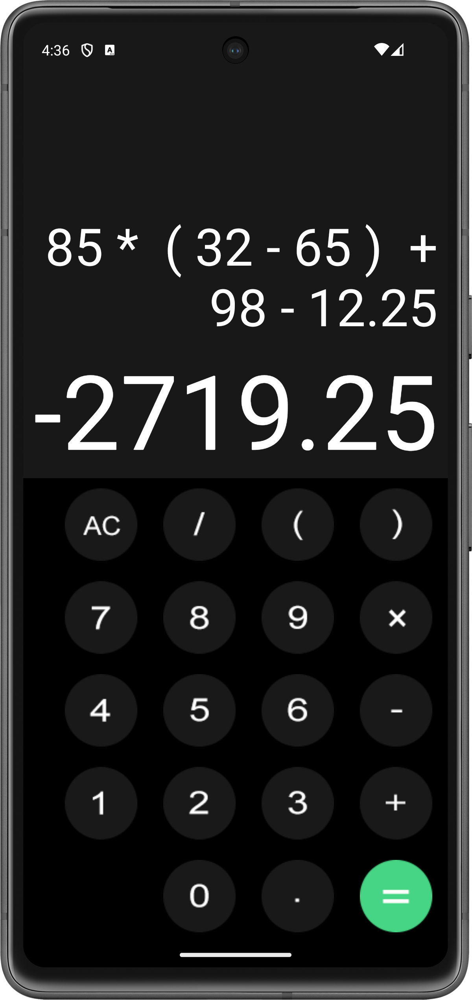

# My Calculator App

## Overview

My Calculator App is a simple and intuitive calculator application for Android, designed to perform basic arithmetic operations. The app features a sleek user interface with a splash screen and supports input via button clicks. Built using Kotlin and the Android SDK, this app utilizes view binding for efficient UI management.

## Features

-   **Basic Arithmetic Operations**: Addition, subtraction, multiplication, and division.
-   **User-Friendly Interface**: Clean layout with buttons for each digit and operation.
-   **Splash Screen**: Welcomes users with a brief introduction before the main calculator interface.
-   **Real-Time Input Display**: Shows the current input and the result after calculation.

## Screenshots

<div align="center">

<!-- Starter Screen  -->

<p style="text-align:center;"><em>The App Splash Screen.</em></p>

<!-- Landscape Mode -->

<p style="text-align:center;"><em>Result of an Operation.</em></p>
<!-- Alert Dialog  -->
</div>

## Technologies Used

-   **Programming Language**: Kotlin
-   **Android SDK**: Android 5.0 (API level 21) and above
-   **Libraries**:
    -   [exp4j](https://github.com/fasseg/exp4j): For evaluating mathematical expressions.

## Installation

1.  Clone the repository:
    
    ``` bash  
    git clone https://github.com/yourusername/mycalculatorapp.git
    
2.  Open the project in Android Studio.
3.  Ensure you have the latest SDK and Gradle version.
4.  Build and run the project on an Android emulator or a physical device.

## Usage

-   Launch the app and wait for the splash screen to transition to the calculator.
-   Tap the buttons to input numbers and operations.
-   Press the equals button to calculate the result.
-   Use the "AC" button to clear the current input and output.

## Code Overview

### MainActivity.kt

The `MainActivity` handles the calculator logic, including:

-   Initializing view binding.
-   Managing button click events to append values to the input field.
-   Evaluating the input expression and displaying the result.

### SplashScreen.kt

The `SplashScreen` class shows a splash screen for 2 seconds before transitioning to the `MainActivity`.

### Layout Files

-   **activity_main.xml**: Layout for the main calculator interface.
-   **activity_splash_screen.xml**: Layout for the splash screen.

## Things I Learned

-   **View Binding**: How to implement view binding to simplify UI code and reduce boilerplate.
-   **Mathematical Expression Evaluation**: Utilized the `exp4j` library to parse and evaluate mathematical expressions.
-   **User Interface Design**: Gained experience in designing intuitive layouts and user interactions in Android.
-   **Lifecycle Management**: Understood the Android activity lifecycle, particularly with the implementation of the splash screen.

## Contribution

Feel free to fork the repository and submit a pull request with improvements or new features.
